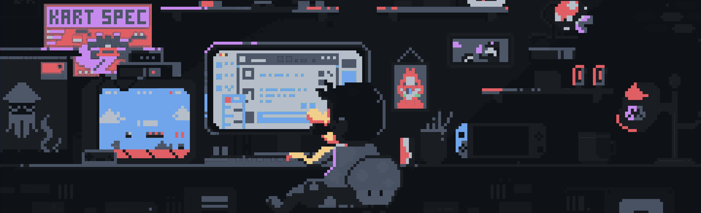

# 💫 About Me:
### About Me 👋   Hi there! I'm Sushant **prefinal-year cybersecurity student** at **Chennai Institute of Technology**, passionate about **ethical hacking, digital forensics, and network security**.    - 🔭 Building cybersecurity projects, exploring malware analysis, and penetration testing.   - 🤝 Cybersecurity research, CTFs, and open-source security tools.   - 💡 Advanced threat hunting techniques and reverse engineering.   - 🌐 Cybersecurity internships and self-learning advanced tools.   - ⚡ I enjoy solving CTF challenges and breaking down complex security concepts into simple explanations!   

## 🌐 Socials:
  

# 💻 Tech Stack:
                                         
# 📊 GitHub Stats:
 
 

---

<!-- Proudly created with GPRM ( https://gprm.itsvg.in ) -->

<picture>
  <source media="(prefers-color-scheme: dark)" srcset="https://raw.githubusercontent.com/SushantVijay/SushantVijay/output/github-snake-dark.svg" />
  <source media="(prefers-color-scheme: light)" srcset="https://raw.githubusercontent.com/SushantVijay/SushantVijay/output/github-snake.svg" />
  
</picture>
